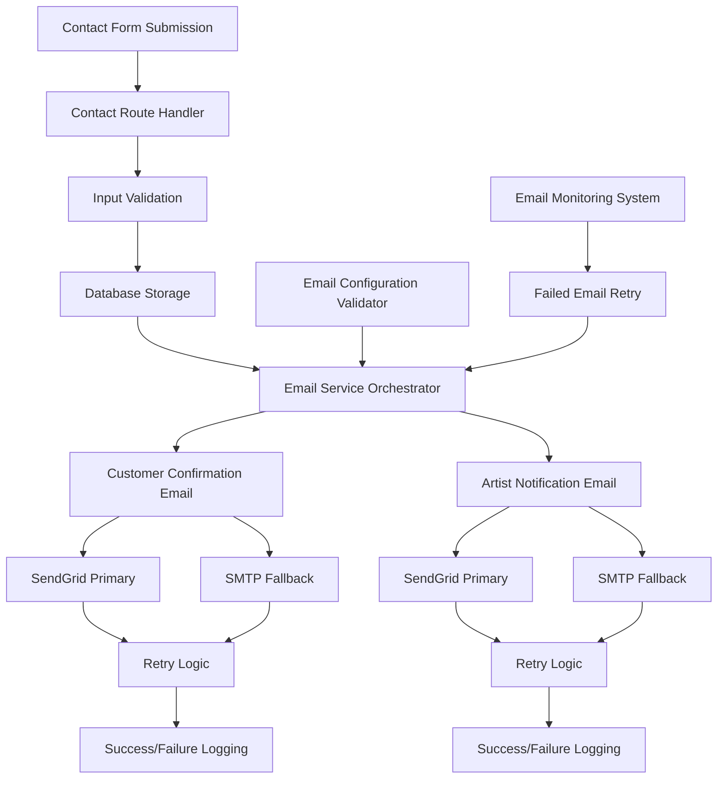
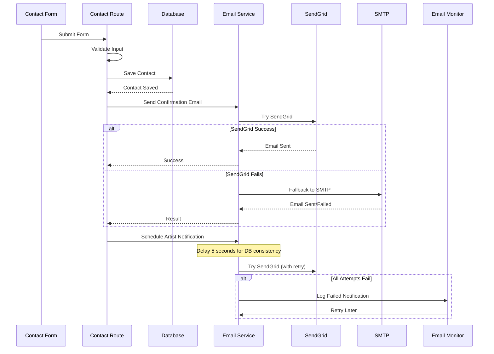

# Email Functionality Fix Design

## Overview

The email functionality fix addresses critical issues in the contact form email system. The current implementation has placeholder configurations, potential TypeScript compilation errors, and lacks proper error handling that could cause server startup failures. This design provides a robust, fault-tolerant email system that supports both SendGrid and SMTP fallback methods while ensuring the application remains stable regardless of email service availability.

## Architecture

### High-Level Architecture



### Email Service Flow



## Components and Interfaces

### 1. Email Configuration Manager

**Purpose**: Validates and manages email service configurations on startup

**Interface**:
```typescript
interface EmailConfig {
  sendgridApiKey?: string;
  fromEmail: string;
  artistEmail: string;
  smtpConfig?: {
    host: string;
    port: number;
    user?: string;
    pass?: string;
  };
}

interface EmailConfigValidator {
  validateConfig(): EmailConfigValidationResult;
  getActiveProvider(): 'sendgrid' | 'smtp' | 'none';
  isConfigValid(): boolean;
}
```

**Key Features**:
- Validates SendGrid API key format and connectivity
- Tests SMTP configuration if available
- Provides fallback configuration when primary service unavailable
- Never throws errors that would prevent server startup

### 2. Enhanced Email Service

**Purpose**: Orchestrates email sending with multiple providers and retry logic

**Interface**:
```typescript
interface EmailService {
  sendContactConfirmationEmail(contact: IContact): Promise<EmailResult>;
  sendContactNotificationEmail(contact: IContact): Promise<EmailResult>;
  sendContactNotificationWithRetry(contact: IContact, maxRetries?: number): Promise<boolean>;
  scheduleContactNotification(contact: IContact, delayMs?: number): void;
}

interface EmailResult {
  success: boolean;
  provider: 'sendgrid' | 'smtp';
  messageId?: string;
  error?: string;
  retryCount?: number;
}
```

**Key Features**:
- Automatic provider fallback (SendGrid → SMTP)
- Exponential backoff retry mechanism
- Comprehensive error logging
- Email tracking and metrics
- Graceful degradation when all providers fail

### 3. Email Template Engine

**Purpose**: Generates consistent, branded email content

**Interface**:
```typescript
interface EmailTemplate {
  generateHTML(data: any): string;
  generateText(data: any): string;
  validateData(data: any): boolean;
}

interface TemplateEngine {
  getContactConfirmationTemplate(): EmailTemplate;
  getContactNotificationTemplate(): EmailTemplate;
  renderTemplate(templateName: string, data: any): EmailContent;
}
```

**Key Features**:
- Responsive HTML templates with brand consistency
- Plain text fallbacks for all emails
- Template validation and error handling
- Consistent styling across all email types

### 4. Email Monitoring and Recovery System

**Purpose**: Monitors email delivery and handles failed notifications

**Interface**:
```typescript
interface EmailMonitor {
  retryFailedNotifications(): Promise<void>;
  logEmailMetrics(): Promise<EmailMetrics>;
  trackEmailDelivery(contact: IContact, result: EmailResult): Promise<void>;
}

interface EmailMetrics {
  totalSent: number;
  successRate: number;
  failuresByProvider: Record<string, number>;
  averageDeliveryTime: number;
}
```

**Key Features**:
- Periodic retry of failed email notifications
- Email delivery metrics and reporting
- Database tracking of email status
- Automated recovery for transient failures

## Data Models

### Enhanced Contact Model

The existing Contact model will be extended with email tracking fields:

```typescript
interface IContact extends Document {
  // Existing fields...
  contactNumber: string;
  customer: CustomerInfo;
  query: string;
  status: 'new' | 'contacted' | 'completed';
  
  // Enhanced email tracking fields
  emailNotificationSent: boolean;
  emailNotificationSentAt?: Date;
  emailNotificationAttempts: number;
  emailNotificationLastAttempt?: Date;
  emailNotificationError?: string;
  confirmationEmailSent: boolean;
  confirmationEmailSentAt?: Date;
  
  // Metadata
  createdAt: Date;
  updatedAt: Date;
}
```

### Email Delivery Log

New model for tracking email delivery attempts:

```typescript
interface IEmailDeliveryLog extends Document {
  contactId: string;
  emailType: 'confirmation' | 'notification';
  provider: 'sendgrid' | 'smtp';
  status: 'pending' | 'sent' | 'failed' | 'retrying';
  attempts: number;
  lastAttemptAt: Date;
  messageId?: string;
  errorMessage?: string;
  deliveredAt?: Date;
  createdAt: Date;
}
```

## Error Handling

### 1. Configuration Errors

**Strategy**: Graceful degradation with comprehensive logging

- Invalid SendGrid API key → Fallback to SMTP
- Invalid SMTP configuration → Log warning, continue without email
- Missing email configuration → Log warning, continue without email
- Never prevent server startup due to email configuration issues

### 2. Runtime Email Errors

**Strategy**: Retry with exponential backoff and fallback providers

```typescript
interface RetryStrategy {
  maxRetries: number; // 3 attempts
  backoffMultiplier: number; // 2x delay each retry
  maxDelay: number; // 30 seconds maximum
  fallbackProvider: boolean; // Try alternate provider
}
```

**Error Scenarios**:
- Network timeouts → Retry with backoff
- API rate limits → Exponential backoff with longer delays
- Authentication failures → Switch to fallback provider
- Service unavailable → Schedule retry for later

### 3. Database Errors

**Strategy**: Ensure contact form submission succeeds even if email fails

- Contact saved to database first
- Email failures logged but don't affect form submission
- Failed emails queued for retry
- User receives success message regardless of email status

## Testing Strategy

### 1. Unit Tests

**Email Service Tests**:
```typescript
describe('EmailService', () => {
  test('should send confirmation email via SendGrid');
  test('should fallback to SMTP when SendGrid fails');
  test('should retry failed emails with exponential backoff');
  test('should handle invalid email configurations gracefully');
  test('should track email delivery status correctly');
});
```

**Configuration Validator Tests**:
```typescript
describe('EmailConfigValidator', () => {
  test('should validate SendGrid API key format');
  test('should test SMTP connectivity');
  test('should provide fallback configurations');
  test('should never throw startup-blocking errors');
});
```

### 2. Integration Tests

**Contact Form Flow Tests**:
```typescript
describe('Contact Form Integration', () => {
  test('should submit form and send both emails successfully');
  test('should submit form even when all email services fail');
  test('should retry failed notifications automatically');
  test('should update database with email delivery status');
});
```

**Email Provider Tests**:
```typescript
describe('Email Provider Integration', () => {
  test('should send emails via SendGrid with valid API key');
  test('should send emails via SMTP with valid configuration');
  test('should handle provider-specific errors correctly');
  test('should switch providers on failure');
});
```

### 3. End-to-End Tests

**Complete User Journey**:
- User submits contact form
- Confirmation email received by customer
- Notification email received by artist within 2 minutes
- Failed emails automatically retried
- Email delivery tracked in database

### 4. Error Simulation Tests

**Failure Scenarios**:
- SendGrid API key invalid/expired
- SMTP server unreachable
- Network connectivity issues
- Database connection failures
- High email volume/rate limiting

## Implementation Phases

### Phase 1: Configuration and Validation
- Implement EmailConfigValidator
- Add startup configuration validation
- Ensure server starts regardless of email config issues
- Add comprehensive logging for configuration status

### Phase 2: Enhanced Email Service
- Refactor existing email service with provider abstraction
- Implement retry logic with exponential backoff
- Add provider fallback mechanism
- Enhance error handling and logging

### Phase 3: Database Enhancements
- Extend Contact model with email tracking fields
- Create EmailDeliveryLog model
- Add database indexes for email queries
- Implement email status tracking

### Phase 4: Monitoring and Recovery
- Implement email monitoring system
- Add periodic retry for failed notifications
- Create email metrics and reporting
- Add email delivery dashboard (admin interface)

### Phase 5: Testing and Validation
- Comprehensive unit and integration tests
- End-to-end testing with real email providers
- Error simulation and recovery testing
- Performance testing under load

## Security Considerations

### 1. Email Configuration Security
- Store API keys in environment variables only
- Validate email addresses to prevent injection
- Rate limiting on contact form submissions
- Input sanitization for email content

### 2. Email Content Security
- HTML email template sanitization
- Prevent email header injection
- Validate recipient email addresses
- Secure handling of customer data in emails

### 3. Monitoring and Logging
- Log email attempts without exposing sensitive data
- Secure storage of email delivery logs
- Access controls for email metrics dashboard
- Audit trail for email configuration changes

## Performance Considerations

### 1. Email Delivery Performance
- Asynchronous email sending (non-blocking)
- Connection pooling for SMTP
- Batch processing for multiple emails
- Caching of email templates

### 2. Database Performance
- Indexes on email tracking fields
- Efficient queries for failed email retry
- Cleanup of old email delivery logs
- Optimized contact form submission flow

### 3. Monitoring Performance
- Lightweight email metrics collection
- Efficient retry scheduling
- Minimal impact on server startup time
- Graceful degradation under high load

## Deployment and Configuration

### 1. Environment Variables
```bash
# Primary email service (SendGrid)
SENDGRID_API_KEY=sg.xxx  # Optional, fallback to SMTP if not provided
FROM_EMAIL=aurabyshenoi@gmail.com  # Required
ARTIST_EMAIL=aurabyshenoi@gmail.com  # Required

# SMTP fallback configuration
SMTP_HOST=smtp.gmail.com  # Optional
SMTP_PORT=587  # Optional
SMTP_USER=aurabyshenoi@gmail.com  # Optional
SMTP_PASS=app_password  # Optional

# Email service configuration
EMAIL_RETRY_ATTEMPTS=3  # Optional, default 3
EMAIL_RETRY_DELAY=1000  # Optional, default 1000ms
EMAIL_NOTIFICATION_DELAY=5000  # Optional, default 5000ms
```

### 2. Production Deployment
- Validate all email configurations before deployment
- Test email delivery in staging environment
- Monitor email delivery rates post-deployment
- Set up alerts for email service failures

### 3. Monitoring and Alerting
- Email delivery success rate monitoring
- Failed email notification alerts
- Email service health checks
- Performance metrics dashboard