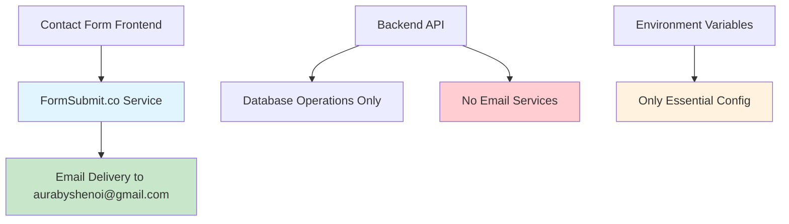
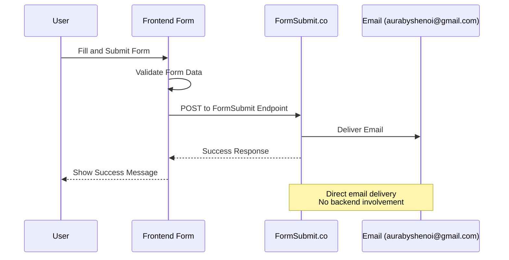

# FormSubmit Email Fix Design

## Overview

This design addresses the issue where contact form submissions show "query submitted successfully" but emails are not being received. The solution involves completely removing all backend email service dependencies and ensuring the FormSubmit.co integration is properly configured for reliable email delivery.

## Architecture

### Current State Analysis

The current system has a hybrid approach with both FormSubmit.co frontend integration and legacy backend email services, which may be causing conflicts or confusion. The frontend is correctly using FormSubmit.co, but the backend still contains extensive email service code that needs to be removed.

### Target Architecture



### Email Flow



## Components and Interfaces

### 1. FormSubmit.co Configuration

**Current Configuration Analysis:**
- Endpoint: `https://formsubmit.co/aurabyshenoi@gmail.com` ✓
- Email formatting: Using custom HTML template ✓
- Reply-to configuration: Set to customer email ✓
- Auto-response: Configured ✓

**Potential Issues:**
- FormSubmit.co may require email verification
- Custom template might be too complex
- Rate limiting or spam detection

**Enhanced Configuration:**
```typescript
interface FormSubmitConfig {
  endpoint: string; // https://formsubmit.co/aurabyshenoi@gmail.com
  fields: {
    _subject: string; // Custom subject line
    _template: 'box' | 'table' | 'basic'; // Simplified template
    _replyto: string; // Customer email
    _captcha: boolean; // Disable captcha
    _format: 'html' | 'plain'; // Email format
    _autoresponse: string; // Auto-reply message
  };
}
```

### 2. Backend Cleanup

**Components to Remove:**
- `emailService.ts` - Complete removal
- `emailConfigValidator.ts` - Complete removal
- `emailNotificationMonitor.ts` - Complete removal
- Contact route email functionality
- All SendGrid/SMTP dependencies

**Components to Keep:**
- Contact model (for database storage if needed)
- Basic contact route (for database operations only)

### 3. Frontend Form Enhancement

**Current Implementation Review:**
The ContactFormSubmit component is well-implemented with:
- Proper validation
- Retry logic
- Error handling
- Fallback contact information

**Potential Improvements:**
- Simplify email template
- Add FormSubmit.co verification check
- Enhanced debugging for submission issues

## Data Models

### Simplified Contact Model (Optional)

If database storage is still needed:

```typescript
interface IContact {
  _id: string;
  contactNumber: string;
  customer: {
    fullName: string;
    email: string;
    phone?: string;
  };
  query: string;
  status: 'new' | 'contacted' | 'completed';
  submittedVia: 'formsubmit'; // Track submission method
  createdAt: Date;
  updatedAt: Date;
}
```

**Note:** Database storage may not be necessary if FormSubmit.co is the only email delivery method.

## Error Handling

### 1. FormSubmit.co Service Issues

**Common Issues:**
- Email not verified with FormSubmit.co
- Rate limiting (too many submissions)
- Spam detection blocking emails
- Invalid email template format

**Solutions:**
- Verify email with FormSubmit.co service
- Implement proper rate limiting on frontend
- Simplify email template
- Add debugging information

### 2. Email Delivery Issues

**Potential Causes:**
- Emails going to spam folder
- FormSubmit.co service downtime
- Invalid email configuration
- Email provider blocking

**Mitigation:**
- Use simple, clean email templates
- Provide clear fallback contact information
- Monitor FormSubmit.co service status
- Test with different email providers

### 3. Frontend Error Handling

**Current Implementation:**
- Network timeout handling ✓
- Retry logic with exponential backoff ✓
- Fallback contact information ✓
- User-friendly error messages ✓

## Testing Strategy

### 1. FormSubmit.co Integration Testing

**Test Scenarios:**
- Submit form with valid data
- Verify email delivery to aurabyshenoi@gmail.com
- Test email formatting and content
- Verify reply-to functionality
- Test auto-response delivery

### 2. Backend Cleanup Verification

**Test Scenarios:**
- Verify all email service code removed
- Confirm no SendGrid/SMTP dependencies
- Test server startup without email config
- Verify no email-related environment variables required

### 3. Error Handling Testing

**Test Scenarios:**
- FormSubmit.co service unavailable
- Network connectivity issues
- Invalid form data submission
- Rate limiting scenarios

## Implementation Phases

### Phase 1: Backend Cleanup
1. Remove all email service files
2. Clean up contact route
3. Remove email-related dependencies
4. Update environment configuration

### Phase 2: FormSubmit.co Verification
1. Verify email address with FormSubmit.co
2. Test email delivery
3. Simplify email template if needed
4. Add debugging information

### Phase 3: Frontend Optimization
1. Enhance error messages
2. Add FormSubmit.co status checking
3. Improve user feedback
4. Test all error scenarios

### Phase 4: Testing and Validation
1. End-to-end testing
2. Email delivery verification
3. Error handling validation
4. Performance testing

## FormSubmit.co Service Details

### Email Verification Process

FormSubmit.co requires email verification:
1. First form submission triggers verification email
2. Click verification link in email
3. Subsequent submissions work normally

### Service Limitations

- Rate limiting: ~50 submissions per month (free tier)
- No custom domains without paid plan
- Limited template customization
- No delivery guarantees

### Alternative Configuration

If current setup fails, consider:
- Simplified email template
- Basic text format instead of HTML
- Remove custom template content
- Use default FormSubmit.co formatting

## Debugging and Monitoring

### 1. FormSubmit.co Status

**Monitoring:**
- Check FormSubmit.co service status
- Verify email delivery logs
- Monitor submission success rates
- Track error patterns

### 2. Email Delivery Verification

**Testing Methods:**
- Test submissions from different devices
- Check spam folders
- Verify with different email providers
- Monitor delivery timing

### 3. Frontend Debugging

**Debug Information:**
- Log FormSubmit.co responses
- Track submission attempts
- Monitor error patterns
- Capture network issues

## Security Considerations

### 1. Form Security

**Current Measures:**
- Client-side validation ✓
- Rate limiting ✓
- Input sanitization ✓

**Additional Measures:**
- CSRF protection (if backend used)
- Honeypot fields for spam prevention
- IP-based rate limiting

### 2. Email Security

**FormSubmit.co Handles:**
- Spam prevention
- Email validation
- Delivery security
- Data protection

## Performance Considerations

### 1. Frontend Performance

**Optimizations:**
- Minimize form submission payload
- Efficient error handling
- Fast user feedback
- Optimized retry logic

### 2. Backend Performance

**After Cleanup:**
- Reduced server load (no email processing)
- Faster startup time (no email config)
- Simplified dependencies
- Lower resource usage

## Deployment Considerations

### 1. Environment Cleanup

**Variables to Remove:**
- SENDGRID_API_KEY
- SMTP_HOST, SMTP_PORT, SMTP_USER, SMTP_PASS
- FROM_EMAIL (if not used elsewhere)
- Email service configuration

**Variables to Keep:**
- ARTIST_EMAIL (for reference only)
- Database configuration
- Other non-email services

### 2. Service Dependencies

**Dependencies to Remove:**
- @sendgrid/mail
- nodemailer
- Email-related packages

**Dependencies to Keep:**
- Core application dependencies
- Database drivers
- Other service integrations