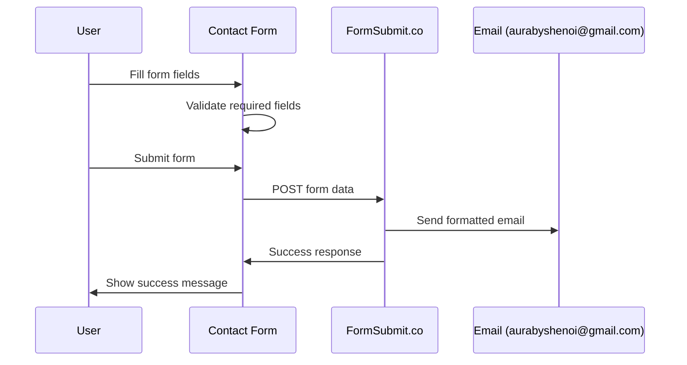

# FormSubmit Integration Design

## Overview

This design implements a contact form that integrates with FormSubmit.co to send properly formatted emails to aurabyshenoi@gmail.com. The solution replaces backend email handling with a third-party service, eliminating the need for SendGrid/SMTP configuration while ensuring reliable email delivery with professional formatting.

## Architecture

### High-Level Architecture

```mermaid
graph TB
    A[Contact Form Component] --> B[Form Validation]
    B --> C[FormSubmit.co Service]
    C --> D[Email Delivery]
    D --> E[aurabyshenoi@gmail.com]
    
    F[Success Page] --> A
    G[Error Handling] --> A
    
    C --> F
    C --> G
```

### Form Submission Flow



## Components and Interfaces

### 1. Enhanced Contact Form Component

**Purpose**: Replaces existing contact form with FormSubmit.co integration

**Interface**:
```typescript
interface ContactFormData {
  name: string;
  email: string;
  phone?: string;
  message: string;
}

interface FormSubmitConfig {
  endpoint: string;
  subject: string;
  template: string;
  redirectUrl?: string;
}

interface ContactFormProps {
  onSubmitSuccess?: () => void;
  onSubmitError?: (error: string) => void;
}
```

**Key Features**:
- Client-side validation for required fields
- Professional email template formatting
- Success/error state management
- Responsive design matching existing site style
- Accessibility compliance

### 2. Email Template Configuration

**Purpose**: Ensures emails are formatted professionally and consistently

**Template Structure**:
```html
Subject: New Contact Form Submission - [Customer Name]

Email Body Template:
---
NEW CONTACT FORM SUBMISSION
---

Customer Details:
• Name: [Customer Name]
• Email: [Customer Email]
• Phone: [Customer Phone]
• Submitted: [Current Date/Time]

Message:
[Customer Message]

---
Reply directly to this email to respond to the customer.
```

**FormSubmit.co Configuration**:
- Custom subject line with customer name
- Structured HTML template for readability
- Reply-to field set to customer email
- Professional formatting with clear sections

### 3. Form Validation System

**Purpose**: Ensures data quality before submission to FormSubmit.co

**Validation Rules**:
```typescript
interface ValidationRules {
  name: {
    required: true;
    minLength: 2;
    pattern: /^[a-zA-Z\s]+$/;
  };
  email: {
    required: true;
    pattern: /^[^\s@]+@[^\s@]+\.[^\s@]+$/;
  };
  phone: {
    required: false;
    pattern: /^[\+]?[1-9][\d]{0,15}$/;
  };
  message: {
    required: true;
    minLength: 10;
    maxLength: 1000;
  };
}
```

**Key Features**:
- Real-time validation feedback
- Clear error messages
- Prevents submission of invalid data
- Sanitizes input to prevent injection

### 4. Success/Error Handling

**Purpose**: Provides clear feedback to users after form submission

**Interface**:
```typescript
interface SubmissionState {
  status: 'idle' | 'submitting' | 'success' | 'error';
  message?: string;
  isLoading: boolean;
}

interface FormResponse {
  success: boolean;
  message: string;
  redirectUrl?: string;
}
```

**Key Features**:
- Loading states during submission
- Success confirmation with clear messaging
- Error handling with retry options
- Graceful fallback for network issues

## Data Models

### Contact Form Data Structure

```typescript
interface ContactSubmission {
  // Required fields
  name: string;
  email: string;
  message: string;
  
  // Optional fields
  phone?: string;
  
  // Hidden FormSubmit.co fields
  _subject: string;           // Email subject line
  _template: string;          // Email template name
  _replyto: string;          // Customer email for replies
  _next?: string;            // Success redirect URL
  _captcha?: boolean;        // Enable captcha if needed
}
```

### FormSubmit.co Integration Fields

```typescript
interface FormSubmitFields {
  // Standard form fields (visible to user)
  name: string;
  email: string;
  phone: string;
  message: string;
  
  // Hidden configuration fields
  _subject: string;          // "New Contact Form Submission - {name}"
  _template: "table";        // Use table template for formatting
  _replyto: string;          // Customer email address
  _next: string;             // Success page URL
  _captcha: false;           // Disable captcha for better UX
}
```

## Error Handling

### 1. Client-Side Validation Errors

**Strategy**: Prevent invalid submissions with clear feedback

- Required field validation with inline error messages
- Email format validation with helpful suggestions
- Phone number format validation (optional field)
- Message length validation with character counter
- Real-time validation feedback as user types

### 2. Network and Submission Errors

**Strategy**: Graceful handling of connectivity issues

```typescript
interface ErrorHandling {
  networkTimeout: {
    timeout: 10000; // 10 second timeout
    retryAttempts: 2;
    fallbackMessage: "Please try again or contact us directly";
  };
  
  formSubmitErrors: {
    invalidEmail: "Please check the email address format";
    serverError: "Submission failed. Please try again";
    rateLimited: "Too many submissions. Please wait before trying again";
  };
}
```

**Error Scenarios**:
- Network connectivity issues → Show retry option
- FormSubmit.co service unavailable → Display fallback contact info
- Invalid form data → Clear validation messages
- Rate limiting → Inform user to wait before retrying

### 3. Fallback Contact Information

**Strategy**: Always provide alternative contact methods

When FormSubmit.co is unavailable, display:
- Direct email: aurabyshenoi@gmail.com
- Alternative contact methods
- Clear instructions for manual contact
- Apology message with expected resolution time

## Testing Strategy

### 1. Unit Tests

**Form Validation Tests**:
```typescript
describe('ContactForm Validation', () => {
  test('should validate required name field');
  test('should validate email format');
  test('should validate optional phone format');
  test('should validate message length requirements');
  test('should prevent submission with invalid data');
});
```

**FormSubmit Integration Tests**:
```typescript
describe('FormSubmit Integration', () => {
  test('should format form data correctly for FormSubmit.co');
  test('should include all required hidden fields');
  test('should handle FormSubmit.co response correctly');
  test('should redirect to success page after submission');
});
```

### 2. Integration Tests

**End-to-End Form Tests**:
```typescript
describe('Contact Form E2E', () => {
  test('should submit form and receive success confirmation');
  test('should display validation errors for invalid input');
  test('should handle network errors gracefully');
  test('should show loading state during submission');
});
```

**Email Delivery Tests**:
```typescript
describe('Email Delivery', () => {
  test('should send formatted email to aurabyshenoi@gmail.com');
  test('should include all form fields in email template');
  test('should set customer email as reply-to address');
  test('should use custom subject line with customer name');
});
```

### 3. User Experience Tests

**Accessibility Tests**:
- Form labels and ARIA attributes
- Keyboard navigation support
- Screen reader compatibility
- Color contrast compliance

**Responsive Design Tests**:
- Mobile device compatibility
- Tablet layout optimization
- Desktop form presentation
- Cross-browser compatibility

## Implementation Phases

### Phase 1: Form Component Development
- Create new ContactForm component with FormSubmit.co integration
- Implement client-side validation with real-time feedback
- Add loading states and error handling
- Style form to match existing site design

### Phase 2: Email Template Configuration
- Configure FormSubmit.co endpoint for aurabyshenoi@gmail.com
- Set up email template with professional formatting
- Test email delivery and formatting
- Configure reply-to and subject line customization

### Phase 3: Integration and Testing
- Replace existing contact form with new FormSubmit component
- Add comprehensive error handling and fallback options
- Implement success/error state management
- Add unit and integration tests

### Phase 4: User Experience Enhancement
- Add form validation animations and transitions
- Implement accessibility improvements
- Add mobile-responsive optimizations
- Create success page with clear next steps

## Security Considerations

### 1. Input Validation and Sanitization
- Client-side validation for all form fields
- HTML encoding of user input to prevent XSS
- Email format validation to prevent injection
- Message length limits to prevent abuse

### 2. Rate Limiting and Spam Prevention
- FormSubmit.co built-in spam protection
- Client-side rate limiting for repeated submissions
- Optional captcha integration if spam becomes an issue
- Input sanitization for all form fields

### 3. Data Privacy
- No sensitive data stored client-side
- FormSubmit.co handles data transmission securely
- Clear privacy notice about email handling
- Compliance with data protection requirements

## Performance Considerations

### 1. Form Loading Performance
- Lightweight component with minimal dependencies
- Lazy loading of validation libraries
- Optimized form rendering for mobile devices
- Fast initial page load times

### 2. Submission Performance
- Direct submission to FormSubmit.co (no backend processing)
- Optimized form data serialization
- Efficient error handling without page reloads
- Quick user feedback on submission status

### 3. User Experience Performance
- Instant validation feedback
- Smooth loading state transitions
- Responsive form interactions
- Minimal network requests

## Configuration and Deployment

### 1. FormSubmit.co Setup
```html
<!-- FormSubmit.co endpoint configuration -->
<form action="https://formsubmit.co/aurabyshenoi@gmail.com" method="POST">
  <!-- Form fields -->
  <input type="text" name="name" required>
  <input type="email" name="email" required>
  <input type="tel" name="phone">
  <textarea name="message" required></textarea>
  
  <!-- Hidden configuration fields -->
  <input type="hidden" name="_subject" value="New Contact Form Submission">
  <input type="hidden" name="_template" value="table">
  <input type="hidden" name="_captcha" value="false">
  <input type="hidden" name="_next" value="https://yoursite.com/success">
</form>
```

### 2. Environment Configuration
```typescript
// FormSubmit configuration
const FORMSUBMIT_CONFIG = {
  endpoint: 'https://formsubmit.co/aurabyshenoi@gmail.com',
  successUrl: `${window.location.origin}/contact-success`,
  template: 'table',
  captcha: false
};
```

### 3. Production Deployment
- Test FormSubmit.co integration in staging environment
- Verify email delivery to aurabyshenoi@gmail.com
- Configure success page redirect URL
- Set up monitoring for form submission success rates

## Migration from Existing Contact Form

### 1. Component Replacement Strategy
- Create new FormSubmit-based contact form component
- Maintain existing form styling and layout
- Replace backend contact route with client-side submission
- Remove email service dependencies from backend

### 2. Backward Compatibility
- Ensure new form maintains same user experience
- Keep existing form validation behavior
- Preserve form field names and structure
- Maintain responsive design patterns

### 3. Testing and Rollout
- A/B test new form against existing implementation
- Monitor email delivery success rates
- Gather user feedback on form experience
- Gradual rollout with fallback to original form if needed